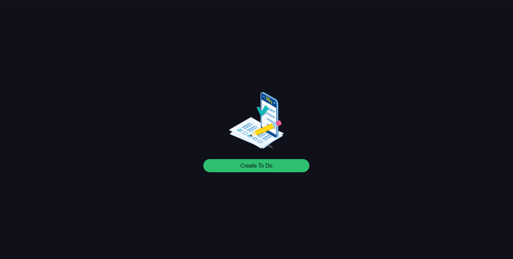
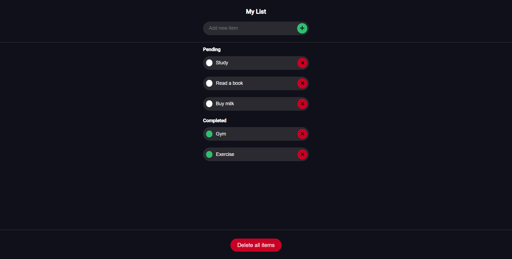

# To Do List

A simple TODO List application built with Angular, allowing users to manage tasks by adding, editing, completing, and deleting them.

## Screenshots

### Home

### TODO List

## Build

Run `ng build` to build the project. The build artifacts will be stored in the `dist/` directory.

## Development Server

Run `ng serve` for a dev server. Navigate to `http://localhost:4200/`. The application will automatically reload if you change any of the source files.

## Further Help

To get more help on the Angular CLI use `ng help` or check out the [Angular CLI Overview and Command Reference](https://angular.io/cli) page.
